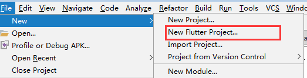
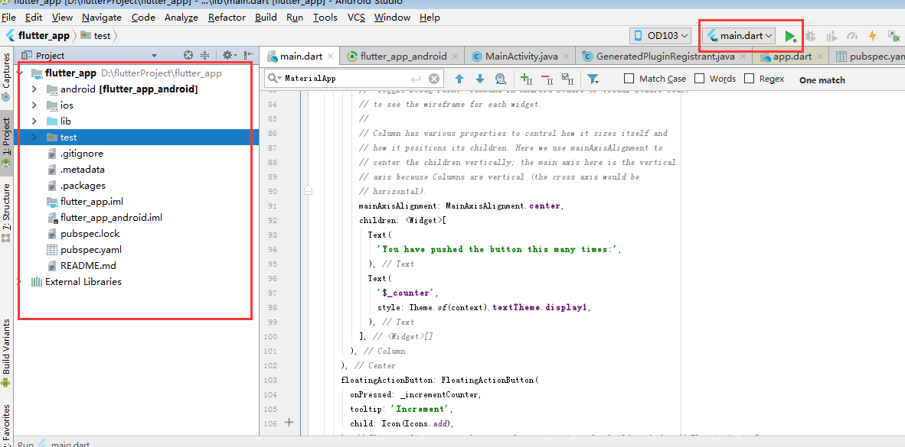
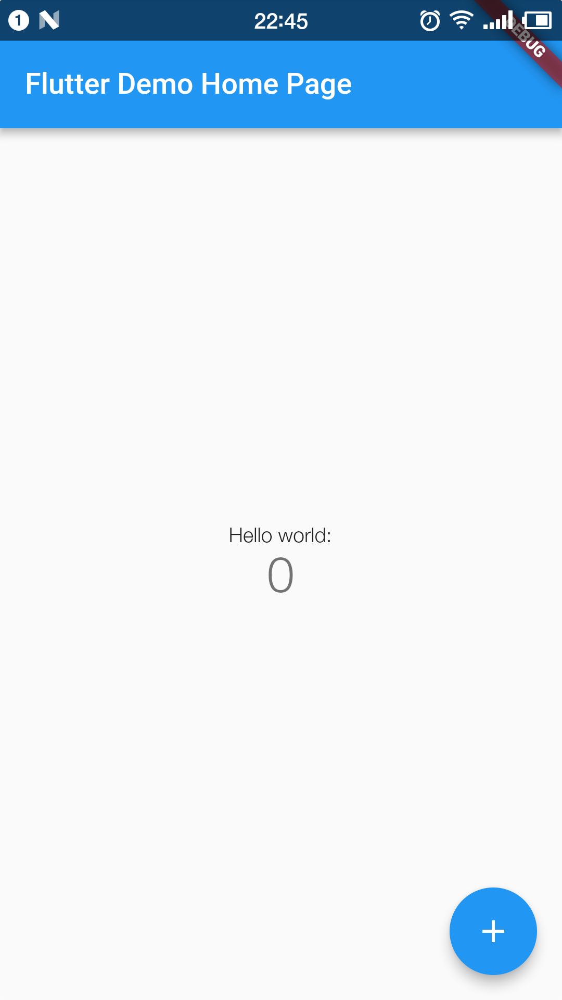

# Flutter入门（一）环境配置

在/flutter/bin目录下执行 flutter doctor命令。

### 3、android studio插件
下载android studio就不说了，打开android studio/file/setting/plugin/

输入 flutter查找并install。
第一次可能下不下来。我的电脑第一次就没下下来，是回家后打开电脑重新下载才下下来的，猜测可能是下载完flutter sdk、或者配置flutter环境变量后需要重启电脑。

在安装完插件并重新启动android studio就可以在 file/new/中看到一个新选项 New Flutter Project

## hello word
按照惯例，接下来我们跑一个hello world。

照上面的new/new Flutter Project 然后 next、next、next一个新项目就建好了。

### 项目目录

项目目录和rn目录类似，android、ios原生工程。lib放混合开发的dart文件，
pubspec.yaml项目的配置文件，类似于rn、react中的package.json，声明项目版本、依赖等。
在运行后如android，会在项目根目录的build（和android同目录）下生成构建之后的文件，这一点和rn以及之前的android项目很不一样，之前的androidbuild都是在/app/build/目录下。

### 运行
点击上面截图右上角绿三角run，第一次运行会比较慢。main.dart是主入口的混合文件。我们可以修改截图中间的文本内容，再运行

第一次运行结束，后面就需要熟悉dart语法，查看原生里的源码看实现原理。
