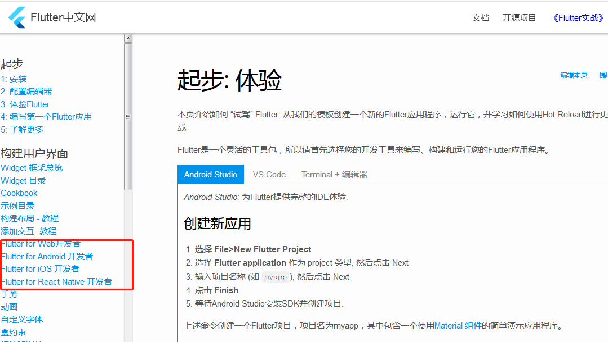

# Flutter入门（三）布局组件

之前吐槽过flutter中文网文档写的不好，后来发现维护者更新的好快，而且也从各种开发的角度来介绍flutter，很skr，点赞！



查看这些可以从这些角度去理解flutter开发，学起来也会事半功倍

### ui组件
学一个新的开发框架，当hello world运行起来后，接下来肯定是了解并使用一些基本的ui组件。
#### Text
 
```
Text(
    '要显示的文本', 
    {
        textAlign: TextAlign.center, // 文本横向对齐方式 居中
        overflow: TextOverflow.ellipsis, // 文本溢出处理方式
        textDirection: TextDirection.ltr, // 文本方向 ltr(left to right) rtl(right to left)
        softWrap: true, // 是否自动换行
        textScaleFactor: 2.0, // 字体显示倍率
        maxLines: 1, // 文本最大行数
        style: new TextStyle(
            color: Colors.purple,
            fontSize: 20.0,
        ), // 文本样式
    }
)


```
