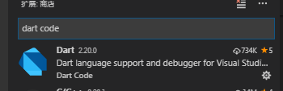
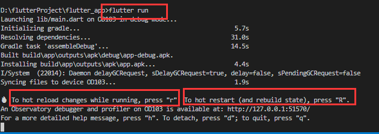

# Flutter入门（二） 使用vscode编写第一个Flutter应用

在上一篇中我们利用android studio运行了一个hello word项目。
作为我个人而言最喜欢的编辑器是vscode，肯定要能在vscode中写代码并运行flutter项目才行。

###1、配置插件
需要在vscode中下载插件

找到这两个插件下载好并重新加载vscode就可以了。

###2、运行
flutter项目的运行命令是 flutter run
但是flutter和react-native不同的是，flutter run之后会检测是否连接设备，如果没有已连接的设备会不往下运行。
你可以通 flutter devices, 当然你配置了android的环境的话，也可以用dab命令， adb devices。

在项目运行起来后，在下方的终端会有一些输出信息，编译耗时、打debug包、安装等。
还有有一些提示信息

当你需要热加载的时候按 r，需要重启应用按R。
所以当我们每一次写好代码保存后，只要再按一下r，就可以看到最新的效果，而且flutter的热加载比rn的更快。

###3、写第一个flutter应用。
按照flutter中文网（https://flutterchina.club/get-started/codelab/）
写我们第一个flutter应用。
其中我个人碰到一个问题。
就是在第2步、使用外部package中，

在pubspec.yaml文件中申明了插件依赖，保存之后自动下载了，然后在main.dart文件中引用该插件，发现没有自动补全提示，我手写全部路径，提示找不到。
然后重新打开vscode才好，应该是vscode对这个以来的读取问题。

然后是接着照着中文的代码写。flutter的也有state，据说是根据react中的state来的想法加入的。

###个人体会

**flutter项目比rn流畅，编译快，热加载快，应用运行也更流畅，但dart语法是真蛋疼**

fluuter中文网写的文档感觉也不是很友好，很多关键的东西写的不够具体、甚至没写。
没有对state这个做解释、没有state的使用说明，然后那个路由也是。

##待续