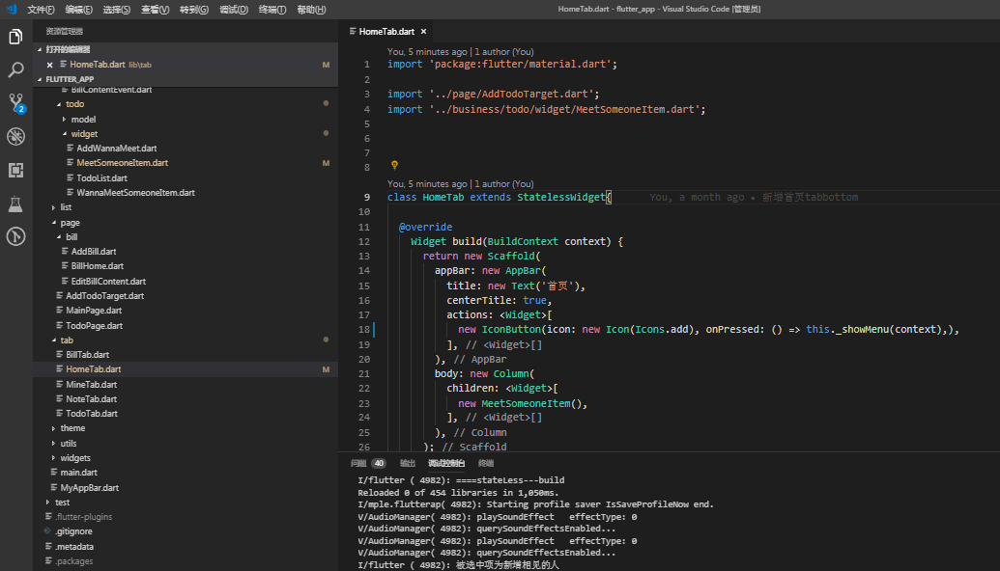
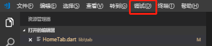
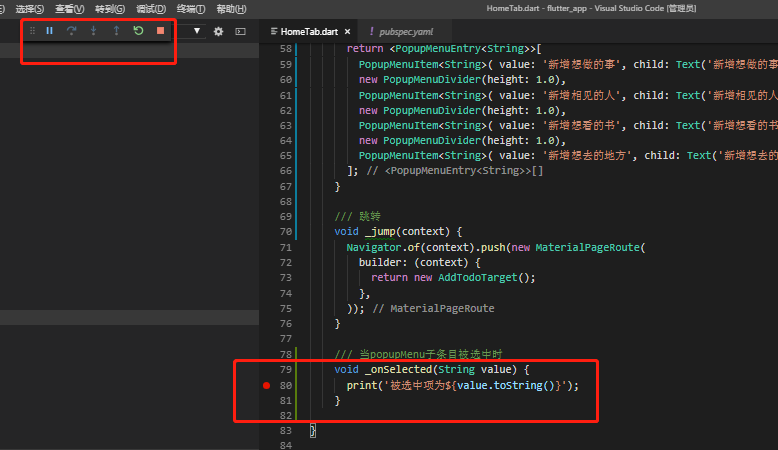
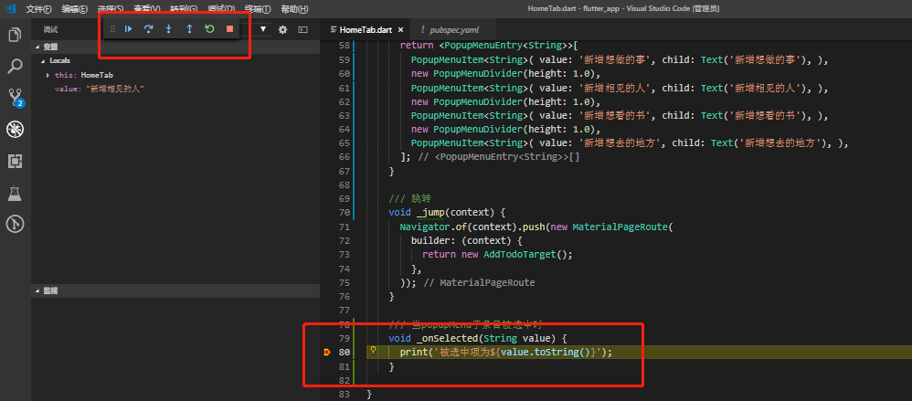
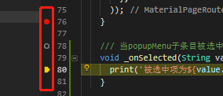

# flutter入门  vscode调试及查看日志

开发肯定需要调试应用，以及查看日志。

在flutter中有logger包，调用未找到Log里的函数，只有Logger.root.info('')等函数，运行时也不起作用。

还有一个print()函数，最终发现这个是可以的。

#### 情景再现

a、通过 flutter run方法启动应用，通过flutter logs查看日志，发现并没有日志输出。

b、通过flutter run方法启动应用，在 调试控制台 也没看到日志输出

c、通过vscode 自带的调试台启动启用，flutter logs，也没有日志输出

#### 正确方法

print()日志输出函数
通过vscode 自带的调试台启动应用， 查看调试控制台，有日志输出

ps: 我重启应用后发现，在终端cmd 通过flutter 也能看到日志输出了。

#### 用vscode调试flutetr

一个正常的flutter项目用vscode应该是这样的。
之前有说过可以用flutter run命令运行，还有android studio运行。在vscode中也有按钮运行调试。

点击调试按钮/启动调试按钮，就相当于flutter run运行该flutter项目

我打了一个断点，当项目运行起来，如下图。

当我点击按钮，进入断点。如下图
可以看到左上角的操作按钮，其实跟android studio调试原生代码，以及浏览器调试rn一样。

添加断点点击代码左侧的红框区域即可（下图）。

在左上角的调试/新建断点 也可以。
