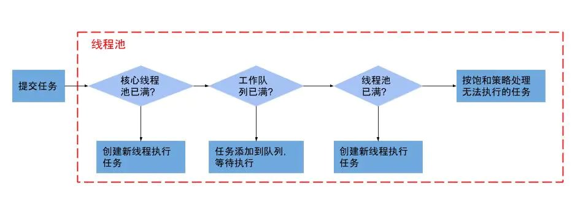

# java 线程池
线程池是用来管理以及调度线程的容器。

## 线程池的优势

* 复用线程，避免大量线程重复创建、销毁，降低消耗
* 提升效率，当线程池内未饱和时，无需等待线程的重新创建和初始化，便能立即执行
* 方便线程并发管理，避免线程无限制的创建，可能造成的OOM、cpu过高等问题，规定了最大并发数
* 延时定时执行任务

## 创建线程池
创建线程池的几种方法：
```
ExecutorService pool = Executors.newCachedThreadPool();
ExecutorService pool1 = Executors.newFixedThreadPool(1);
ExecutorService pool2 = Executors.newScheduledThreadPool(1);
ExecutorService pool3 = Executors.newSingleThreadScheduledExecutor();

ExecutorService pool4 = new ThreadPoolExecutor(0, 10, 60,
            TimeUnit.SECONDS, new LinkedBlockingDeque<>(), Executors.defaultThreadFactory(), new ThreadPoolExecutor.AbortPolicy());
```

最后都会执行到ThreadPoolExecutor的构造函数中


## 线程池参数


```
public ThreadPoolExecutor(int corePoolSize, int maximumPoolSize, long keepAliveTime, TimeUnit unit, BlockingQueue<Runnable> workQueue) {
    this(corePoolSize, maximumPoolSize, keepAliveTime, unit, workQueue,
         Executors.defaultThreadFactory(), defaultHandler);
}

public ThreadPoolExecutor(int corePoolSize,
                              int maximumPoolSize,
                              long keepAliveTime,
                              TimeUnit unit,
                              BlockingQueue<Runnable> workQueue,
                              ThreadFactory threadFactory,
                              RejectedExecutionHandler handler) {
        if (corePoolSize < 0 ||
            maximumPoolSize <= 0 ||
            maximumPoolSize < corePoolSize ||
            keepAliveTime < 0)
            throw new IllegalArgumentException();
        if (workQueue == null || threadFactory == null || handler == null)
            throw new NullPointerException();
        this.corePoolSize = corePoolSize;
        this.maximumPoolSize = maximumPoolSize;
        this.workQueue = workQueue;
        this.keepAliveTime = unit.toNanos(keepAliveTime);
        this.threadFactory = threadFactory;
        this.handler = handler;
    }
```
即时是ThreadPoolExecutor的其他几个构造函数，最后也会调用到这个7参的构造函数


* corePoolSize: 核心线程数量，当向线程池提交一个任务时，如果线程数小于核心线程数，不管是否有线程处于空闲状态，都会创建一个新的线程来执行该任务，
直到线程池中的线程数大于等于核心线程数量
* maximumPoolSize: 最大线程数，线程池中线程数量最大值，当向线程池提交任务，核心线程都已创建完毕，且核心线程都处于工作状态，此时会先将该任务提交到阻塞队列，如果阻塞队列已满， 并线程池中线程数量小于最大线程数时，此时会新创建一个线程执行该任务。如果阻塞队列已满，且线程数也达到最大值，此时会执行线程饱和策略。

* keepAliveTime：非核心线程可空闲时长，非核心线程处于空闲时，且空闲时长超过keepAliveTime，则该线程会被回收，但不会回收核心线程

* unit： keepAliveTime的时长单位

* workQueue： 阻塞队列，用于保存和运输待执行任务的阻塞队列

* threadFactory：线程工厂，用于创建工作线程，threadFactory也是采用new Thread()形式创建一个新线程，但命名线程名称，格式为：pool-m-thread-n（m为线程池的编号，n为线程池内的线程编号）。

* defaultHandler： 线程饱和策略，当线程池和阻塞队列都满了，再添加任务时，会执行此策略


线程池第5个参数，是传入一个等待队列，一般来说等待队列有三种：ArrayBlockingQueue、LinkedBlockingQueue、SynchronousQueue

* ArrayBlocking: 基于数组的等待队列，初始化需要指定固定大小
    当使用此队列，向线程池提交任务时，会首先加入到等待队列中，当等待队列满了，提交到队列中失败时，就是就会检查线程池的最大线程数是否达到最大，没有则启动线程执行任务。
    所以最终可能出现后提交的任务先执行，而先提交的任务还在等待队列等待执行。
* LinkedBlockingQueue: 基于链表的等待队列，初始化可以指定大小，也可以不指定
   当指定大小后，表现就和 ArrayBlockingQueue 一致，如果没指定大小，则会使用默认的integer.MAX_VALUE,此时添加任务会一直成功。
   最终所有的任务都会在核心线程中执行，如果核心线程线程被占用，则会一直等待。
* SynchronousQueue: 无容量的队列
    使用此队列就是希望拥有最大的并发量，因为无论如何，向队列中添加任务都会失败，此时就会一直检查线程池线程数是否达到最大线程数，没有达到则会一直新建线程来执行任务。
    唯一制约就是配置的最大线程数，如果使用Integer.MAX_VALUE就实现了真正的无等待。


## 运行流程
;


##### execute 提交任务

```
public void execute(Runnable command) {
        if (command == null)
            throw new NullPointerException();
        /*
         * Proceed in 3 steps:
         *
         * 1. If fewer than corePoolSize threads are running, try to
         * start a new thread with the given command as its first
         * task.  The call to addWorker atomically checks runState and
         * workerCount, and so prevents false alarms that would add
         * threads when it shouldn't, by returning false.
         *
         * 2. If a task can be successfully queued, then we still need
         * to double-check whether we should have added a thread
         * (because existing ones died since last checking) or that
         * the pool shut down since entry into this method. So we
         * recheck state and if necessary roll back the enqueuing if
         * stopped, or start a new thread if there are none.
         *
         * 3. If we cannot queue task, then we try to add a new
         * thread.  If it fails, we know we are shut down or saturated
         * and so reject the task.
         */
        int c = ctl.get();
        if (workerCountOf(c) < corePoolSize) {
            if (addWorker(command, true))
                return;
            c = ctl.get();
        }
        if (isRunning(c) && workQueue.offer(command)) {
            int recheck = ctl.get();
            if (! isRunning(recheck) && remove(command))
                reject(command);
            else if (workerCountOf(recheck) == 0)
                addWorker(null, false);
        }
        else if (!addWorker(command, false))
            reject(command);
    }
```
ctl是一个原子Integer对象，存储的是正在运行的线程数
看英文注释也写的很清楚了，分三部，
1、判断正在运行的线程是否小于核心线程数，是的话则 调用 addWorker(command, true)；并不再向下执行
2、判断队列能否添加command 以及 线程池是否还在运行，而且双重检测，成功将加任务加入到阻塞队列，
    再进行第二次判断，如果线程池没有再运行 && 移除这个任务，执行拒绝
    或者工作线程数 == 0， 则直接 addWorker(null, false);
3、尝试添加失败，执行 reject(command)


##### addWorker
查看添加任务的函数

```
retry:
    for (;;) {
        int c = ctl.get();
        int rs = runStateOf(c);
            
        // Check if queue empty only if necessary.
        if (rs >= SHUTDOWN &&
            ! (rs == SHUTDOWN &&
            firstTask == null &&
            ! workQueue.isEmpty()))
                return false;
            
        for (;;) {
            int wc = workerCountOf(c);
            if (wc >= CAPACITY ||
                wc >= (core ? corePoolSize : maximumPoolSize))
                return false;
            if (compareAndIncrementWorkerCount(c))
                break retry;
            c = ctl.get();  // Re-read ctl
            if (runStateOf(c) != rs)
                continue retry;
            // else CAS failed due to workerCount change; retry inner loop
        }
    }
```


外层for循环： 当线程池已经 SHUTDOWN时，不能添加任务
内层for循环：当前线程数大于总容量 ｜｜ 为添加核心线程时，> 核心线程数 当为非核心线程时，> 最大线程数，不能添加任务
    如果能添加时，终止外层for循环
    
compareAndIncrementWorkerCount 函数是将当前的正在运行的线程数 + 1；
    
```
        boolean workerStarted = false;
        boolean workerAdded = false;
        Worker w = null;
        try {
            w = new Worker(firstTask);
            final Thread t = w.thread;
            if (t != null) {
                final ReentrantLock mainLock = this.mainLock;
                mainLock.lock();
                try {
                    // Recheck while holding lock.
                    // Back out on ThreadFactory failure or if
                    // shut down before lock acquired.
                    int rs = runStateOf(ctl.get());

                    if (rs < SHUTDOWN ||
                        (rs == SHUTDOWN && firstTask == null)) {
                        if (t.isAlive()) // precheck that t is startable
                            throw new IllegalThreadStateException();
                        workers.add(w);
                        int s = workers.size();
                        if (s > largestPoolSize)
                            largestPoolSize = s;
                        workerAdded = true;
                    }
                } finally {
                    mainLock.unlock();
                }
                if (workerAdded) {
                    t.start();
                    workerStarted = true;
                }
            }
        } finally {
            if (! workerStarted)
                addWorkerFailed(w);
        }


```
Worker 是ThreadPoolExecutor中的内部类，implements Runnable
此处就是在构建一个Worker，并启动线程执行。


### 流程总结


当提交一个任务时，

1、查询核心线程是否已满，如果未满则新创建核心线程执行该任务

2、当核心线程已满，判断阻塞队列是否已满，如果阻塞队列未满则将该任务加入到阻塞队列中

3、当阻塞队列已满时，判断线程池是否已满，如果未满，则新创建线程执行该任务

4、当线程池已满时，则执行饱和策略

而且当未达到最大线程数时，会取出队列中的任务执行。

## 线程池为何需要使用阻塞队列

1、因为线程池是管理并调度线程、以完成任务，肯定不可能无限制的创建线程，

2、提高核心线程的使用效率
