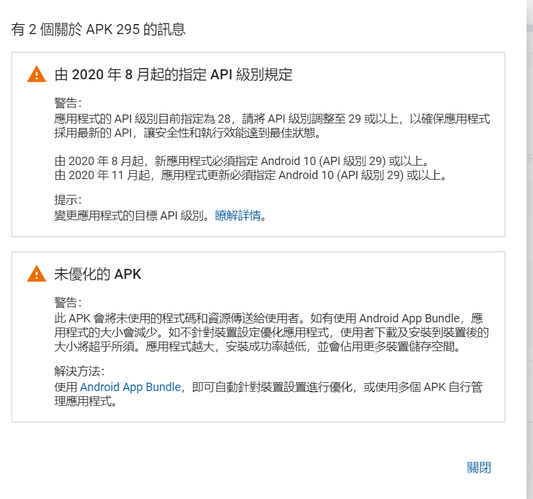

# google play 提交要求


本文于2020/09/09日起记录在google play提交版本时，google play提出的提交要求

## targetSdkVersion
在2020/08/05日，提交版本发现多了一个警告


新提交的应用在8月开始，必须设定targetSdkVersion为29或以上，
已存在的应用提交新版本时，必须设定targetSdkVersion为29或以上


### 关于targetSdkVersion的原理
targetSdkVersion相当于在编写代码时设定一个假想的运行手机版本，打包后，再运行到真实设备。
最终的运行表现取决与targetSdkVersion与真实运行设备版本中的低值。


targetSdkVersion的预设就相当于预设一个代码运行环境，
我们所写的代码功能如果是只有部分版本才有的API，我们需要先判断真实的运行版本是否符合。
如在android6.0后引入权限请求，在每次请求权限时，我们需要判断SDK版本是否大于等于23.


```
private void request() {
    if(Build.VERSION.SDK_INT >= Build.VERSION_CODES.M) {
        requestPermissions(new String[]{Manifest.permission.CAMERA}, 101);
    }
}
```
当然，是否需要判断版本其实和minSdkVersion也是有关的，如上面的代码，因为权限请求是23以后的，如果我们直接将minSdkVersion设置为23，则此时就不需要判断版本了，因为肯定是运行在23之后的手机，因为23以前的手机此时会无法安装该应用。

ex:
当我们设定targetSdkVersion=29，即android10，
而用户手机为API=23，即android6.0，
此时app的表现会是6.0。


当我们设定targetSdkVersion=23，即android6，
而用户手机为API=29，即android10，
此时app的表现也会是6.0。


## 64位框架
在去年时，google play要求提及的应用必须支持64位的框架，
也就是.so文件必须支持64位架构，
在提交审核的apk中，有armeabi-v7a则必须也要有arm64-v8a，如果有x86，则必须也要有x86_64。
react-native 原本只有armeabi-v7a，在之后的版本0.59.10中就开始内部源码中支持64位含有arm64-v8a下的.so文件


