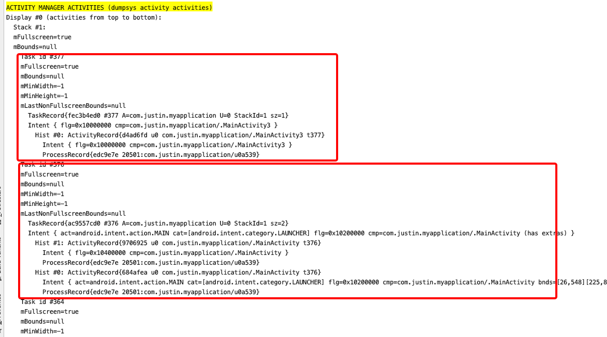

# Activity启动模式

首先，Activity有四大启动模式：
standard、singleTask、singleTop、singleInstance

如何设置Activity的启动模式：
* 静态设置，在AndoridManifest.xml文件中，对Activity设置launchMode
```
<activity
    android:name=".MainActivity3"
    android:launchMode="singleInstance" />
```
* 动态设置，在Activity跳转时，intent设置FLAG
```
    var intent = Intent(this, MainActivity::class.java);
    intent.setFlags(Intent.FLAG_ACTIVITY_SINGLE_TOP)
    startActivity(intent)
```

并且注意，同时设置了两种方式时，动态设置会覆盖静态设置

## launchMode


### standard
standard: 标准模式，默认模式，当设置为此模式时，每一次跳入都会重新创建实例
每次会新创建一个实例，并加入到启动它的Activity的任务栈中。


### singleTask
singleTask: 栈内复用模式，当设置此模式时，如果栈内没有该Activity就会重新创建，如果已经有了，则会复用栈内已存在的该Activity，而不会重新创建，
并会移除之前在栈中处于该Activity上部的所有的Activity。
ex：A的启动模式是standard， B的启动模式为singleTask

A -> B -> A -> B

A -> B 时，因为当前Activity栈中只有A，所以会新创建一个B的实例，
A -> B -> A, 因为A的启动模式为standard，所以会新创建一个A的实例
A -> B -> A -> B, 因为此时栈中已经有B的实例，所以不会重新创建b的实例，而是复用之前B的实例，同时会调用onNewIntent生命周期函数，
而且会销毁之前处于栈顶的A。
最后栈内就是： A、B，B位于栈顶


### singleTop
singleTop：栈顶复用，与singleTask有部分相似，singleTask是只要在栈内就会复用，而singleTop是只有在栈顶才会复用，
如果栈内存在实例，但不处于栈顶，则表现与standard一致，
如果站内存在实例，且处于栈顶，则表现与singleTask一致，

ex：A的启动模式是standard、B的启动模式是singleTop
A -> B -> A -> B
A -> B 时，因为当前Activity栈中只有A，所以会新创建一个B的实例，
A -> B -> A, 因为A的启动模式为standard，所以会新创建一个A的实例
A -> B -> A -> B, 因为此时栈中已经有B的实例，但之前的B不在栈顶，所以会重新创建一个B的实例


### singleInstance
singleInstance: 独立运行在一个单独的task中，而且只会存在一个实例
在Activity跳转时，注意查看，普通的Activity跳转和Activity Task跳转，两者的动画效果是不同的。

ex: A的启动模式是standard、B的启动模式是singleInstance
A -> B -> A -> B
A -> B 时，因为当前Activity栈task A中只有A，会重新创建一个task B并新建一个B的实例放入task B
A -> B -> A, 因为A的启动模式为standard，所以会新创建一个A的实例，并放入到task A中
A -> B -> A -> B, 因为此时栈中已经有B的实例，所以会将task B置顶，
最后的栈情况为： A -> A -> B，如下图所示：




我们可以通过指令：adb shell dumpsys activity
查看Activity栈中的Activity task情况

通过关键字：ACTIVITY MANAGER ACTIVITIES (dumpsys activity activities)
即可搜索到上述截图情况


## 任务栈
我们一直提到一个栈，那什么是Activity所需要的任务栈呢，
这需要提到一个参数：TaskAffinity

### TaskAffinity

可以翻译为任务相关性，这个参数主要标识了一个Activity所需要的任务栈的名字
默认情况下，所有activity所需的任务栈的名字为应用包名。
当然我们也可以为每个Activity单独指定TaskAffinity，但是我们指定的必须不能与包名相同，
否则就相当于没指定。

相同TaskAffinity的Activity会运行在同一个任务栈中

TaskAffinity一般与启动模式或allowTaskReparenting搭配使用

### allowTaskReparenting

当应用A调用应用B的Activity C，
如果Activity C的allowTaskReparenting设置为true，
当应用B被启动后，则会将应用A的任务栈转移到应用B的任务栈。

当应用A调用应用B的Activity C，然后按Home键回到桌面，此时会显示被应用A启动的Activity C，
而不是应用B的默认Activity


